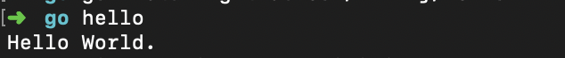

# Golang 编程环境介绍

本文档介绍Go的代码组织以及如何编写一个简单的包

## 工作空间

Go代码必须放在工作空间内。它其实就是一个目录，其中包含三个子目录：

- src 目录包含Go的源文件，它们被组织成包（每个目录都对应一个包），
- pkg 目录包含包对象，
- bin 目录包含可执行命令。

## GOPATH环境变量

GOPATH 环境变量指定了你的工作空间位置。

首先创建一个工作空间目录，并设置相应的 GOPATH。你的工作空间可以放在任何地方， 在此文档中我们使用 $HOME/go。注意，它绝对不能和你的Go安装目录相同。
```zsh
$ mkdir $HOME/go
$ export GOPATH=$HOME/go
```

作为约定，请将此工作空间的 bin 子目录添加到你的 PATH 中：
```zsh
$ export PATH=$PATH:$GOPATH/bin
```


## 包路径

标准库中的包有给定的短路径，比如 "fmt" 和 "net/http"。 对于你自己的包，你必须选择一个基本路径，来保证它不会与将来添加到标准库， 或其它扩展库中的包相冲突。

如果你将你的代码放到了某处的源码库，那就应当使用该源码库的根目录作为你的基本路径。 例如，若你在 GitHub 上有账户 github.com/user 那么它就应该是你的基本路径。

注意，在你能构建这些代码之前，无需将其公布到远程代码库上。只是若你某天会发布它， 这会是个好习惯。在实践中，你可以选择任何路径名，只要它对于标准库和更大的Go生态系统来说， 是唯一的就行。

我们将使用 github.com/user 作为基本路径。在你的工作空间里创建一个目录， 我们将源码存放到其中：

## 第一个程序

要编译并运行简单的程序，首先要选择包路径（我们在这里使用 github.com/user/hello），
并在你的工作空间内创建相应的包目录：

```zsh
$ mkdir $GOPATH/src/github.com/user/hello
```

接着，在该目录中创建名为 hello.go 的文件，其内容为以下Go代码：
```go
package main

import "fmt"

func main() {
	fmt.Printf("Hello, world.\n")
}
```

构建并安装此程序
```zsh
$ go install github.com/user/hello
```
注意，你可以在系统的任何地方运行此命令。go 工具会根据 GOPATH 指定的工作空间，在github.com/user/hello 包内查找源码。

若在从包目录中运行 go install，也可以省略包路径：
```zsh
$ cd $GOPATH/src/github.com/user/hello
$ go install
```

此命令会构建 hello 命令，产生一个可执行的二进制文件。 接着它会将该二进制文件作为 hello（在 Windows 下则为 hello.exe）安装到工作空间的 bin 目录中。 在我们的例子中为 $GOPATH/bin/hello，具体一点就是 $HOME/go/bin/hello。

go 工具只有在发生错误时才会打印输出，因此若这些命令没有产生输出， 就表明执行成功了。

现在，你可以在命令行下输入它的完整路径来运行它了。  
若你已经将 $GOPATH/bin 添加到 PATH 中了，只需输入该二进制文件名即可：  



## 第一个库

下面我们来编写第一个库，让hello程序来使用它。
同样，第一步还是选择包路径（我们将使用 github.com/user/stringutil） 并创建包目录：
```zsh
$ mkdir $GOPATH/src/github.com/user/stringutil
```

接着，在该目录中创建名为 reverse.go 的文件，内容如下：
```go
// stringutil 包含有用于处理字符串的工具函数。
package stringutil

// Reverse 将其实参字符串以符文为单位左右反转。
func Reverse(s string) string {
	r := []rune(s)
	for i, j := 0, len(r)-1; i < len(r)/2; i, j = i+1, j-1 {
		r[i], r[j] = r[j], r[i]
	}
	return string(r)
}
```
现在用 go build 命令来测试该包的编译：
```zsh
$ go build github.com/user/stringutil
```

确认 stringutil 包构建完毕后，修改原来的 hello.go 文件（它位于 $GOPATH/src/github.com/user/hello）去使用它：
```go
package main

import (
	"fmt"

	"github.com/user/stringutil"
)

func main() {
	fmt.Printf(stringutil.Reverse("!oG ,olleH"))
}
```
安装Hello程序
```zsh
$ go install github.com/user/hello
```


做完上面这些步骤后，你的工作空间应该是这样的：
```
bin/
	hello                 # 可执行命令
pkg/
	linux_amd64/          # 这里会反映出你的操作系统和架构
		github.com/user/
			stringutil.a  # 包对象
src/
	github.com/user/
		hello/
			hello.go      # 命令源码
		stringutil/
			reverse.go       # 包源码
```