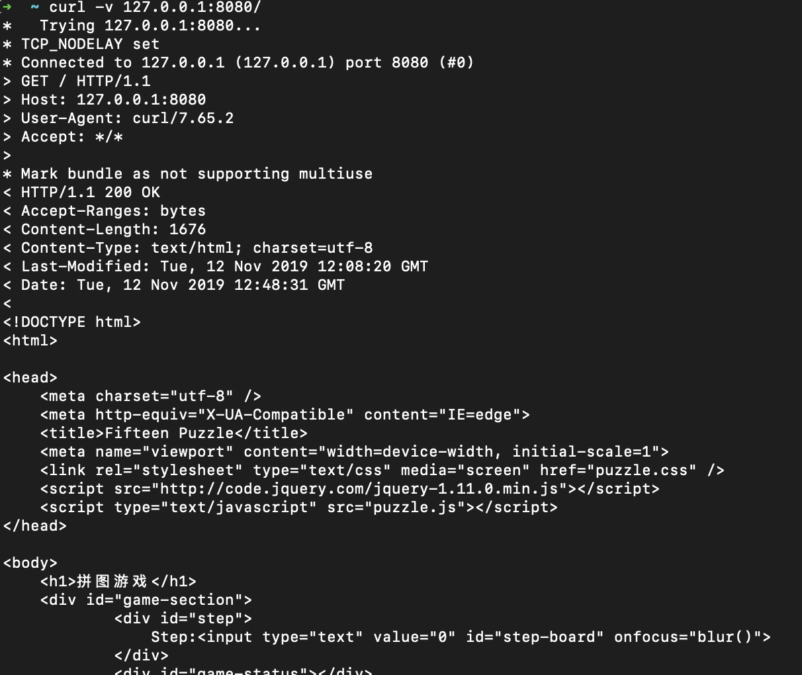
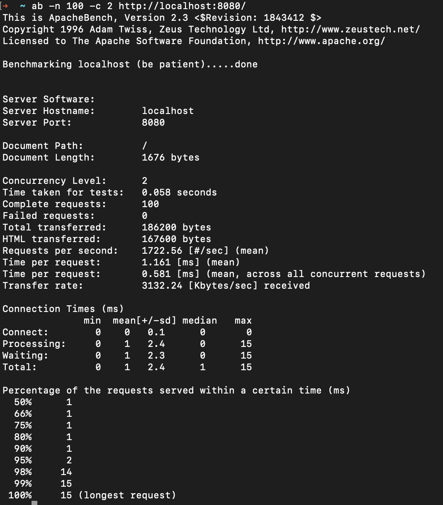

# 开发Web服务程序  
项目地址：[cloudgo](cloudgo)


开发简单 web 服务程序，了解 web 服务器工作原理。

选择轻量组件 gorilla/mux + codegangsta/negroni进行开发。  

## gorilla/mux  

mux代表HTTP request multiplexer，mux.Router根据已注册的route列表匹配对应的请求，然后根据URL调用处理函数。 
在Web开发中，route是指URL到处理函数到映射。route指URL，分配对应的处理函数。  
Request可以根据URL的host、path、路径前缀、模式、head、查询值，HTTP方法或自定义匹配。  
下面这个例子展示如何注册URL path到handler的路由。
```go
func main() {
    r := mux.NewRouter()
    r.HandleFunc("/", HomeHandler)
    r.HandleFunc("/products", ProductsHandler)
    r.HandleFunc("/articles", ArticlesHandler)
    http.Handle("/", r)
}
```
也可以使用前缀匹配URL
```go
    mx.PathPrefix("/").Handler(http.FileServer(http.Dir(webRoot + "/assets/")))
```
HandleFunc传入的是func类型，而Handler传入的时http.Handler类型。

## Negroni
Negroni是一个很地道的 Web 中间件，它是一个具备微型、非嵌入式、鼓励使用原生 net/http 库特征的中间件。  
Negroni没有带路由功能，所以我们选择mux作为路。

使用 UseHandler 把http.Handlers 处理器引入。
```go
n := negroni.New()

mux := http.NewServeMux()
// map your routes

n.UseHandler(mux)

n.Run(":3000")
```

Negroni有一个很好用的函数Run , Run接收addr地址字符串http.ListenAndServe。
```go
package main

import (
  "github.com/urfave/negroni"
)

func main() {
  n := negroni.Classic()
  n.Run(":8080")
}
```
未提供地址的情况下，会使用 PORT 系统环境变量, 若未定义该系统环境变量则会用预设的地址。


## 编写web服务程序
下面我们使用gorilla mux和Negroni编写一个应用。  

```go
package service

import (
	"net/http"
	"os"

	"github.com/gorilla/mux"
	"github.com/unrolled/render"
	"github.com/urfave/negroni"
)

// NewServer configures and returns a Server.
func NewServer() *negroni.Negroni {
	formatter := render.New(render.Options{
		IndentJSON: true,
	})

	n := negroni.Classic()
	mx := mux.NewRouter()

	initRoutes(mx, formatter)

	n.UseHandler(mx)
	return n
}

func initRoutes(mx *mux.Router, formatter *render.Render) {
	// 搜索环境变量WEBROOT,如果不存在返回空。
	webRoot := os.Getenv("WEBROOT")
	if len(webRoot) == 0 {
		if root, err := os.Getwd(); err != nil {
			panic("Could not retrive working directory")
		} else {
			webRoot = root
		}
	}
	// 设置URL path：“/” 到handler的路由。
	mx.Handle("/", http.FileServer(http.Dir(webRoot+"/assets/")))

}
```
```go
package main

import (
	"os"

	"github.com/hixinj/hello/service"
	flag "github.com/spf13/pflag"
)

const (
	PORT string = "8080"
)

func main() {
	port := os.Getenv("PORT")
	if len(port) == 0 {
		port = PORT
	}

	pPort := flag.StringP("port", "p", PORT, "PORT for httpd listening")
	flag.Parse()
	if len(*pPort) != 0 {
		port = *pPort
	}

	server := service.NewServer()
	server.Run(":" + port)
}
```
运行：
```
go run main.go
```
在浏览器访问http://localhost:8080/：
  


## curl测试
  


## ab测试


下面解释一下ab测试  
Apache Bench——ab是一种用于测试Apache超文本传输协议（HTTP）服务器的工具。  

### 参数:  
-n 发起访问的总数 
-c 并发访问数   

### 输出：  
Server Software表示被测试的Web服务器软件名称。

Server Hostname表示请求的URL主机名。

Server Port表示被测试的Web服务器软件的监听端口。

Document Path表示请求的URL中的根绝对路径，通过该文件的后缀名，我们一般可以了解该请求的类型。

Document Length表示HTTP响应数据的正文长度。

Concurrency Level表示并发用户数，这是我们设置的参数之一。

Time taken for tests表示所有这些请求被处理完成所花费的总时间。

Complete requests表示总请求数量，这是我们设置的参数之一。

Failed requests表示失败的请求数量，这里的失败是指请求在连接服务器、发送数据等环节发生异常，以及无响应后超时的情况。如果接收到的HTTP响应数据的头信息中含有2XX以外的状态码，则会在测试结果中显示另一个名为“Non-2xx responses”的统计项，用于统计这部分请求数，这些请求并不算在失败的请求中。

Total transferred表示所有请求的响应数据长度总和，包括每个HTTP响应数据的头信息和正文数据的长度。注意这里不包括HTTP请求数据的长度，仅仅为web服务器流向用户PC的应用层数据总长度。

HTML transferred表示所有请求的响应数据中正文数据的总和，也就是减去了Total transferred中HTTP响应数据中的头信息的长度。

Requests per second吞吐率，计算公式：Complete requests/Time taken for tests

Time per request用户平均请求等待时间，计算公式：Time token for tests/（Complete requests/Concurrency Level）。

Time per request(across all concurrent request)服务器平均请求等待时间，计算公式：Time taken for tests/Complete requests，正好是吞吐率的倒数。也可以这么统计：Time per request/Concurrency Level。

Transfer rate表示这些请求在单位时间内从服务器获取的数据长度，计算公式：Total trnasferred/ Time taken for tests，这个统计很好的说明服务器的处理能力达到极限时，其出口宽带的需求量。

Percentage of requests served within a certain time（ms）这部分数据用于描述每个请求处理时间的分布情况，比如以上测试，90%的请求处理时间都不超过1ms，这个处理时间是指前面的Time per request，即对于单个用户而言，平均每个请求的处理时间。