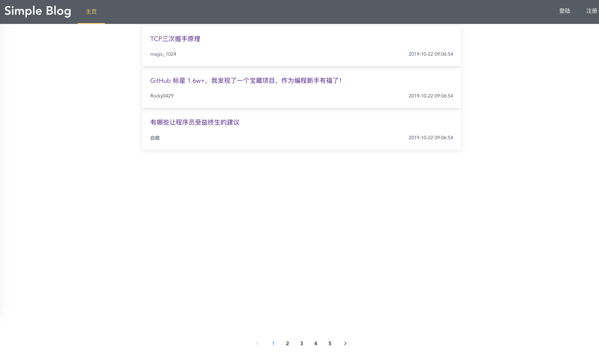

# 简单 web 服务与客户端开发实战——Simple Blog

## 1、概述  
github：https://github.com/BlogByFourMan

Simple Blog是一个极简博客，实现的功能有
- 用户注册
- 用户登陆
- 浏览博客
- 浏览评论
- 发表评论

利用 web 客户端调用远端服务是服务开发本实验的重要内容。其中，要点建立 API First 的开发理念，实现前后端分离，使得团队协作变得更有效率。  


## API设计
我们首先确定API，使用Swagger工具生成go语言的后端接口。  

一共有6个API
- GET /article/{id}/comments
- GET /article/{id} 
- GET /articles
- POST /article/{id}/comments 
- POST /user/login    
- POST /user/register 

对应go代码如下

```go
func ArticleIdCommentsGet(w http.ResponseWriter, r *http.Request) {
}

func ArticleIdGet(w http.ResponseWriter, r *http.Request) {
}

func ArticlesGet(w http.ResponseWriter, r *http.Request) {
}

func ArticleIdCommentPost(w http.ResponseWriter, r *http.Request) {
}

func UserLoginPost(w http.ResponseWriter, r *http.Request) {
}

func UserRegisterPost(w http.ResponseWriter, r *http.Request) {
}
```

## 后端开发  
我主要负责后端开发，包括建立数据库，对数据的CRUD，处理前端请求，返回正确的响应，利用jwt进行用户认证。

后端代码结构:

```
.
├── LICENSE
├── README.md
├── api
│   └── swagger.yaml
├── dal
│   ├── db
│   │   ├── Blog.db
│   │   ├── db.go
│   │   ├── db_test.go
│   │   └── sampleBlog
│   └── model
│       ├── model_article.go
│       ├── model_comment.go
│       ├── model_tag.go
│       └── model_user.go
├── go
│   ├── README.md
│   ├── api_article.go
│   ├── api_user.go
│   ├── jwt.go
│   ├── logger.go
│   ├── response.go
│   └── routers.go
└── main.go
```
dal为数据访问层。   
dal/db/存放了数据库Blog.db；对数据库的访问操作，封装成函数存放在db.go；sampleBlog目录下是一些CSND的博客作为本项目的博客。   
dal/model/定义了Article、comment、tag、user四个结构体.   

go目录下是路由、API响应response、API的实现、jwt签发认证等模块。


### 1、db.go 数据库访问
数据库使用boltDB。Bolt是一个纯粹Key/Value模型的程序。该项目的目标是为不需要完整数据库服务器（如Postgres或MySQL）的项目提供一个简单，快速，可靠的数据库。

BoltDB只需要将其链接到你的应用程序代码中即可使用BoltDB提供的API来高效的存取数据。而且BoltDB支持完全可序列化的ACID事务，让应用程序可以更简单的处理复杂操作
db.go有Init, PutArticles, GetArticles, PutUsers, GetUsers.

Init用于创建数据库。

Blog.db是SimpleBlog的唯一一个数据库， 其下有两个Bucket：
- article （key：articleID）
- user（key：username）


```go
func GetDBPATH() string {
	ostype := runtime.GOOS
	if ostype == "windows" {
		pt, _ := os.Getwd()
		return pt + "\\dal\\db\\Blog.db"
	}
	return path.Join(os.Getenv("GOPATH"), "src", "github.com", "BlogByFourMan", "Server", "dal", "db", "Blog.db")
}
func Init() {
	db, err := bolt.Open(GetDBPATH(), 0600, nil)
	if err != nil {
		log.Fatal(err)
	}
	defer db.Close()

	err = db.Update(func(tx *bolt.Tx) error {
		b := tx.Bucket([]byte("article"))
		if b == nil {
			_, err := tx.CreateBucket([]byte("article"))
			if err != nil {
				log.Fatal(err)
			}
		}

		b = tx.Bucket([]byte("user"))
		if b == nil {
			_, err := tx.CreateBucket([]byte("user"))
			if err != nil {
				log.Fatal(err)
			}
		}
		return nil
	})
	if err != nil {
		log.Fatal(err)
	}

}
```  

数据库的CURD实现大同小异，主要过程为  
1. 打开数据库
2. 获取一个事务：tx
3. 利用tx获取bucket：b
4. 更新或增加——b.Put(key, data)，查询——b.Get(key)


```go
func PutArticles(articles []model.Article) error {
	db, err := bolt.Open(GetDBPATH(), 0600, nil)
	if err != nil {
		log.Fatal(err)
	}
	defer db.Close()

	err = db.Update(func(tx *bolt.Tx) error {
		b := tx.Bucket([]byte("article"))
		if b != nil {
			for i := 0; i < len(articles); i++ {
				id := articles[i].Id
				key := make([]byte, 8)
				binary.LittleEndian.PutUint64(key, uint64(id))
				data, _ := json.Marshal(articles[i])
				b.Put(key, data)
			}
		}
		return nil
	})

	if err != nil {
		return err
	}
	return nil
}

func GetArticles(id int64, page int64) []model.Article {
	articles := make([]model.Article, 0)
	db, err := bolt.Open(GetDBPATH(), 0600, nil)
	if err != nil {
		log.Fatal(err)
	}
	defer db.Close()

	err = db.View(func(tx *bolt.Tx) error {
		b := tx.Bucket([]byte("article"))
		if b != nil && id >= 0 {

			key := make([]byte, 8)
			binary.LittleEndian.PutUint64(key, uint64(id))
			data := b.Get(key)
			if data != nil {

				atc := model.Article{}
				err := json.Unmarshal(data, &atc)
				if err != nil {
					log.Fatal(err)
				}
				articles = append(articles, atc)
			}

		} else if b != nil && id == -1 {
			cursor := b.Cursor()
			nPerPage := 5
			fromKey := make([]byte, 8)
			binary.LittleEndian.PutUint64(fromKey, uint64(page-1)*(uint64)(nPerPage+1))

			for k, v := cursor.Seek(fromKey); k != nil && nPerPage > 0; k, v = cursor.Next() {
				atc := model.Article{}
				err := json.Unmarshal(v, &atc)
				if err != nil {
					log.Fatal(err)
				}
				articles = append(articles, atc)
				nPerPage--
			}
		}
		return nil
	})
	if err != nil {
		log.Fatal(err)
	}

	return articles
}
```

### 2、API实现
根据设计好的API实现相关功能，开发时主要问题在如何读取Request参数，读取到了参数后就是利用db.go的函数CRUD，然后将结果写入Response。

#### Path parameter
例如Get /articles/2/comments  

分解URL：

```go
s := strings.Split(r.URL.Path, "/")
```
#### Query parameter
例如 Get /articles?page=3

```go
r.ParseForm()
pagestr := r.FormValue("page")
```

#### Body parameter

```go
err := json.NewDecoder(r.Body).Decode(&user)
```

我主要负责Article部分，以及User的用户认证。  


用户认证

使用基于 Token 的身份验证方法，在服务端不需要存储用户的登录记录。大概的流程是这样的：

1. 客户端使用用户名跟密码请求登录
2. 服务端收到请求，去验证用户名与密码
3. 验证成功后，服务端会签发一个 Token，再把这个 Token 发送给客户端
4. 客户端收到 Token 以后可以把它存储起来，比如放在 Cookie 里或者 Local Storage 里
5. 客户端每次向服务端请求资源的时候需要带着服务端签发的 Token
6. 服务端收到请求，然后去验证客户端请求里面带着的 Token，如果验证成功，就向客户端返回请求的数据


```go
const SecretKey = "123qwe"

func ValidateToken(w http.ResponseWriter, r *http.Request) (*jwt.Token, bool) {
	token, err := request.ParseFromRequest(r, request.AuthorizationHeaderExtractor,
		func(token *jwt.Token) (interface{}, error) {
			return []byte(SecretKey), nil
		})

	if err != nil {
		w.WriteHeader(http.StatusUnauthorized)
		fmt.Fprint(w, "Unauthorized access to this resource")
		return token, false
	}

	if !token.Valid {
		w.WriteHeader(http.StatusUnauthorized)
		fmt.Fprint(w, "token is invalid")
		return token, false
	}

	return token, true
}

func SignToken(userName string) (string, error) {

	token := jwt.New(jwt.SigningMethodHS256)
	claims := make(jwt.MapClaims)
	claims["exp"] = time.Now().Add(time.Hour * time.Duration(1)).Unix()
	claims["iat"] = time.Now().Unix()
	claims["name"] = userName
	token.Claims = claims
	return token.SignedString([]byte(SecretKey))
}
```

## 前端
这部分由小组其他两位成员负责，使用Vue.js框架开发。  

前端github仓库：https://github.com/BlogByFourMan/Client

界面展示
  

