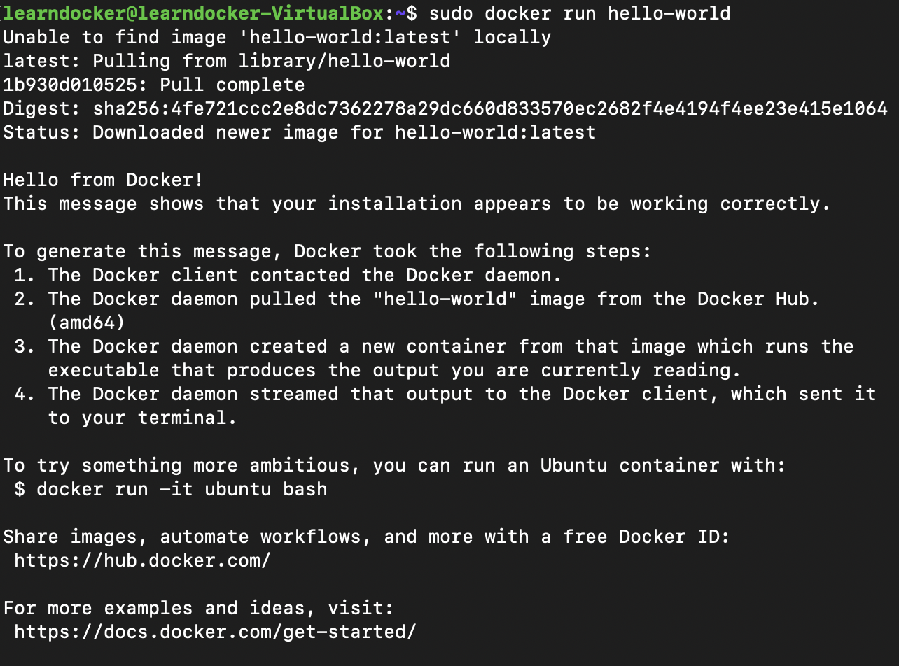

# docker 实践

## 安装Docker

操作系统：Ubuntu 18.04  


1. 由于 apt 源使用 HTTPS 以确保软件下载过程中不被篡改。因此，我们首先需要添加使用
HTTPS 传输的软件包以及 CA 证书。
```bash
$ sudo apt-get install \

    apt-transport-https \

    ca-certificates \

    curl \

    software-properties-common
```


2. 添加 Docker 官方的 GPG  
鉴于国内网络问题，建议使用国内源。
```bash
curl -fsSL https://mirrors.ustc.edu.cn/docker-ce/linux/ubuntu/gpg | sudo apt-key add -
# 官方源
#curl -fsSL https://download.docker.com/linux/ubuntu/gpg | sudo apt-key add -
```


3. 将 Docker 的源添加到 /etc/apt/sources.list    

```bash
sudo add-apt-repository \
"deb [arch=amd64] https://mirrors.ustc.edu.cn/docker-ce/linux/ubuntu \
$(lsb_release -cs) \
stable"

# 官方源
#  sudo add-apt-repository \
# "deb [arch=amd64] https://download.docker.com/linux/ubuntu \
# $(lsb_release -cs) \
# stable
```

4. 更新apt缓存，安装 docker-ce
```bash
$ sudo apt-get update
$  sudo apt-get install docker-ce
```

5. 查看docker版本


## 运行第一个容器

hello-world 是 Docker 官方提供的一个镜像



## 运行mysql容器

拉取mysq镜像


启动服务器  


启动客户端


在容器中查看mysql数据库文件  


## 由 dockerfile 构建容器
下面在ubuntu镜像的基础上安装一个vim构成新的容器  

```bash
~$ mkdir vi-docker
~$ cd vi-docker/
~/vi-docker$ vim dockerfile
```

dockerfile：
```dockerfile
FROM ubuntu
RUN apt-get update && apt-get install -y vim
```

运行 docker build 命令，-t 将新镜像命名为 ubuntu-with-vi-dockerfile，命令末尾的 . 指明 build context 为当前目录。Docker 默认会从 build context 中查找 Dockerfile 文件，我们也可以通过 -f 参数指定 Dockerfile 的位置。
  

安装完成，image ID为908fbdbc61f5：


查看镜像分层结构，ubuntu-with-vi-dockerfile 是通过在 base 镜像的顶部添加一个新的镜像层而得到的:
