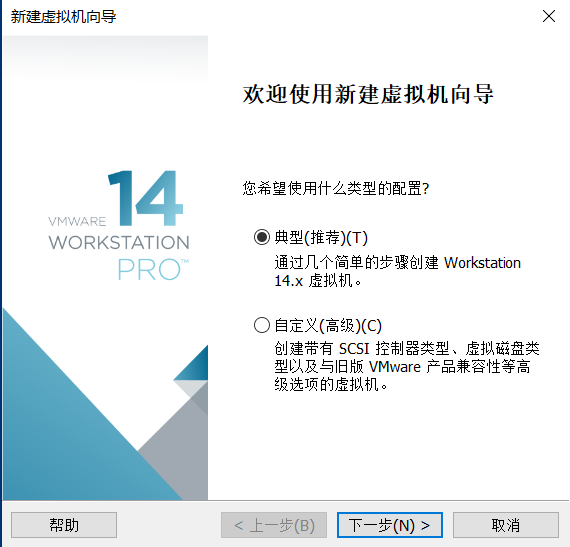
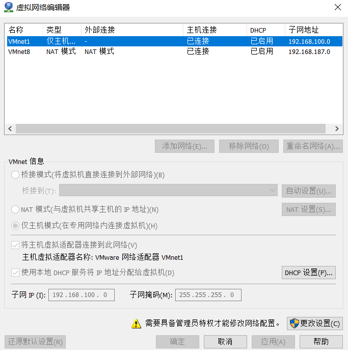
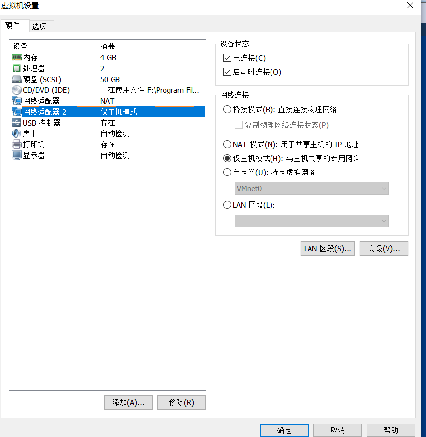
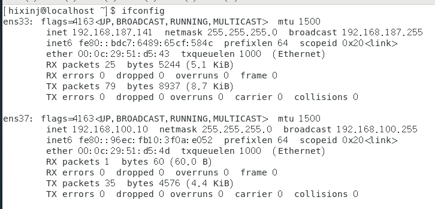
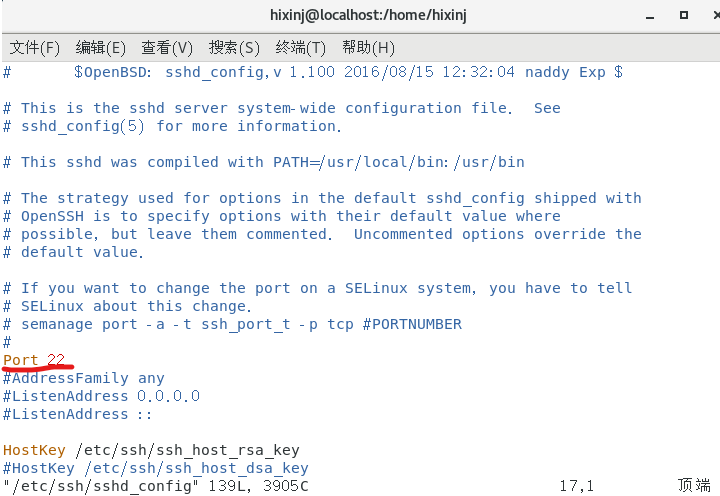
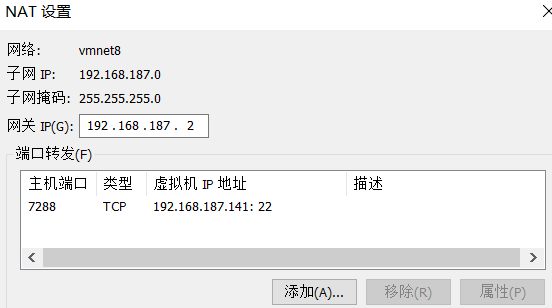

# 安装配置私有云

云桌面又称桌面虚拟化、云电脑，是替代传统电脑的一种新模式；采用云桌面后，用户无需再购买电脑主机，主机所包含的CPU、内存、硬盘、网卡等组件全部在后端的服务器中虚拟出来，单台高性能服务器可以虚拟1-50台不等的虚拟主机；前端设备目前主流的是采用瘦客户机（与电视机顶盒类似的设备）连接显示器和键鼠，用户安装客户端后通过特有的通信协议访问后端服务器上的虚拟机主机来实现交互式操作，达到与电脑一致的体验效果；同时，云桌面不仅支持用于替换传统电脑，还支持手机、平板等其他智能设备在互联网上访问，也是目前移动办公的最新解决方案。  
现在我们就来搭建一个自己的私有云桌面


## 实验环境

- Win10主机
- VMware Workstation
- CentOS 虚拟机
  
## 安装CentOS虚拟机

1. 下载[CentOS发行版镜像](http://isoredirect.centos.org/centos/7/isos/x86_64/CentOS-7-x86_64-Minimal-1810.iso)。  
    Minimal即可。
2. 使用VMware创建虚拟机（具体过程不再细述）  
   - 建议虚拟机CPU、内存采用默认。如果是桌面版，CPU建议数1-2，内存不低于2G
   - 显示，显存采用默认。如果是桌面版，显存越大越好
   - 存储，不低于30G。避免以后扩展难。
   - 网络，第一块网卡必须是 NAT；第二块网卡连接方式： Host-Only，接口就是前面创建的虚拟网卡

3. 安装CentOS图形界面  
    安装完CentOS，打开虚拟机发现是命令行界面  
    - 安装桌面 yum groupinstall "GNOME Desktop"  
    - 设置启动目标为桌面 ln -sf /lib/systemd/system/runlevel5.target /etc/systemd/system/default.target  
    - 重启

## 设置网络

在VMware的“编辑-虚拟网络编辑器”中为主机创建第二块网卡为仅主机模式


在VMware的“虚拟机-设置”中为虚拟机创建第二块网卡仅主机模式


使用nmtui来为虚拟机配置网络，我将第二块网卡IP配置为192.168.100.10/24  

配置完成后使用ifconfig查看网卡信息：
  
在主机上可以ping通192.168.187.141和192.168.100.10  
在虚拟机上也可以ping通主机的192.168.187.141和192.168.100.1

***注意：如果ping不通请关闭防火墙***

## 远程控制服务

sshd服务使用SSH协议可以用来进行远程控制，或在计算机之间传送文件相比较之前用telnet方式来传输文件要安全很多，因为telnet使用明文传输，ssh是加密传输。  

### 1、在win10主机上使用ssh远程连接虚拟机：


### 2、从其他电脑连接win10主机的CentOS虚拟机

在校园网中的其他电脑可以访问我的win10主机，如果配置虚拟机的NAT，则可以通过IP:port的形式访问win10主机中的CentOS虚拟机。

- 配置虚拟机中sshd的端口
    ```
    sudo vim /etc/ssh/sshd_config 
    ```
    
    将Port 22注释去掉，就配置了sshd的端口为22 

- 配置NAT  
  在VMware“编译-虚拟机网络编辑器”中配置VMnet8的NAT  
  主机端口只要是没有被占用的都可以。
  

- 关闭win10主机防火墙

- 从校园网中另一台访问CentOS虚拟机  
  ssh -p port user@ip_addr   
  在这里port=7288， user和ip_addr为win10主机的用户名及IP地址。
